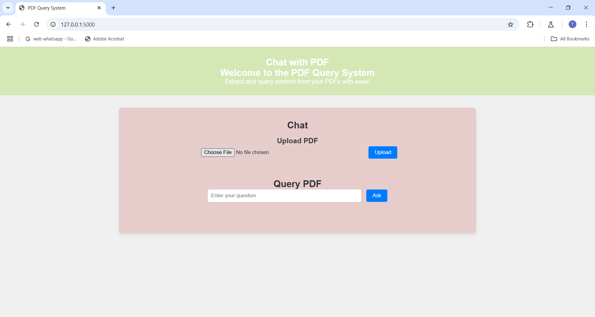

# Chat with PDF

## Overview

The CHat With PDF System allows users to upload PDF files, extract text from them, and interact with the content using natural language queries. This system uses **semantic search** to find relevant text from the PDF based on user queries and can also extract and display tables from the PDF documents.

### Features:
- **PDF Upload**: Upload PDFs and extract the textual content.
- **Semantic Search**: Query the text extracted from PDFs and get relevant answers.
- **Table Extraction**: Extract and display tabular data from PDF files.
- **Interactive Interface**: User-friendly web interface to upload PDFs and ask queries.

## Tools & Technologies

- **Python**: Programming language used for backend development.
- **Flask**: Lightweight web framework for building the backend API.
- **PyPDF2**: Python library for extracting text from PDF files.
- **pdfplumber**: Python library for extracting tables from PDFs.
- **Sentence-Transformers**: Used for semantic embedding of text for efficient search.
- **JavaScript (jQuery)**: For client-side functionality and making AJAX requests.
- **HTML/CSS**: Used for the front-end design of the application.

## Setup & Installation

Follow these steps to get the project up and running on your local machine.

### Prerequisites
1. Python 3.x
2. pip (Python package installer)
3. Libraries (listed in `requirements.txt`):
  - Flask
  - PyPDF2
  - pdfplumber
  - sentence-transformers
  - jQuery (included from CDN)


### Installation Steps

1. **Clone the repository**:

   git clone 


2. **Install the required dependencies**:

   pip install -r requirements.txt

3. **Run the Flask app**:

   python app.py

5. Open your browser and visit `http://127.0.0.1:5000` to access the PDF Query System.




## Usage

1. **Upload a PDF**:
   - Click on the "Upload PDF" section and select a PDF file from your computer.
   - The file will be processed, and its content will be extracted for querying.

2. **Query the PDF**:
   - After uploading the PDF, you can ask questions related to the content of the PDF.
   - Type your question in the "Enter your question" input box and click "Ask".
   - The system will return the most relevant answer based on the semantic search of the PDF text.
   - If your query is related to a table in the document, you can ask about it (e.g., "What is on page 2?"), and the relevant table will be displayed.

3. **Table Extraction**:
   - Queries containing the word "table" or "tabular" will trigger the extraction of tables from the specified page in the PDF.
   - Tables are returned as HTML, making them easy to view and interact with in the interface.

## File Structure

```
/pdf-query-system
│
├── /uploads/                # Folder to store uploaded PDFs
├── /static/                 # Folder for static files (CSS, JS)
│   └── /css/
│       └── style.css        # Styles for the application
│
├── /templates/              # Folder for HTML templates
│   └── index.html           # Main page of the application
│
├── app.py                   # Backend application code (Flask)
├── requirements.txt         # Python dependencies
└── README.md                # This README file
```


## How it Works

1. **PDF Upload**: Users upload a PDF file, which is stored in the `uploads/` folder.
2. **Text Extraction**: The text from the PDF is extracted using `PyPDF2`, and the content is broken into chunks.
3. **Table Extraction**: Using `pdfplumber`, tables from a specific page of the PDF can be extracted and returned to the user.
4. **Semantic Search**: The text chunks are encoded into embeddings using the `Sentence-Transformer` model, which is then used to compare and find the best matching text to the user's query.


